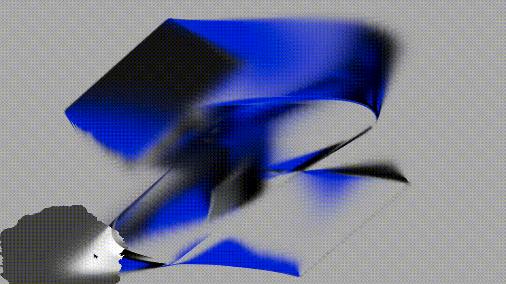

# 🔍 InversionLens Shader 

> A shader-based interactive lens that reveals a color image through a grayscale-inverting, turbulence-distorted circular mask. Built in React with Three.js and GLSL.

---

## 🖼 Preview




---

## ⚙️ Getting Started

This project is written in React and WebGL (Three.js), using custom shaders for dynamic real-time effects.

### Run locally:

```bash
# 1. Clone this repo
git clone https://github.com/suzubu/inversion-lens.git

# 2. Install dependencies
npm install

# 3. Start dev server
npm run dev
```

> Requires: Node.js, modern browser with WebGL2 support

---

## ✨ Features

- 🎭 Reveals full-color image through animated grayscale-inverting lens
- 🌪 Jagged, turbulent mask edge using procedural GLSL noise
- 🖱 Follows mouse smoothly with radius easing and aspect correction
- 📏 Automatically resizes with container and device pixel ratio
- 🔍 Uses IntersectionObserver to pause when out of view

---

## 💡 Dev Notes

### 🧠 Shader Details
- `u_mouse`, `u_time`, and `u_radius` drive the distortion and animation
- Fragment shader uses grayscale luminance logic and turbulence functions
- Dynamically adjusts to canvas and image aspect ratio for accurate masking

### ⚛️ Component Behavior (InversionLens.jsx)
- Uses `useRef` extensively to manage Three.js scene, camera, uniforms, and animation
- Loads image via `THREE.TextureLoader` and injects into a fullscreen shader plane
- Listens for mouse movement, scroll, resize, and view intersection
- Performs lerping and radius easing in `requestAnimationFrame` loop

---

## 📚 Inspiration / Credits

- [CodeGrid](https://www.youtube.com/watch?v=aE2cNoyrhZE)
- [The Book of Shaders](https://thebookofshaders.com)
- GLSL experimentation via [Shadertoy](https://shadertoy.com)
- [Milad Fakurian](https://unsplash.com/photos/a-blue-ribbon-curves-through-space-3-QTY22bQGQ)

---

## 🧪 Known Issues

- Mobile touch not yet supported
- Lens turbulence edge may flicker at high intensities
- GPU-intensive on lower-end systems

---

## 🔭 Roadmap / TODO

- [ ] Add mobile/touch lens tracking
- [ ] GUI controls to adjust lens parameters in real time
- [ ] Fade-in/fade-out lens transitions

---

## 📂 Folder Structure

```bash
inversion-lens/
├── public/
│   └── img.jpeg
├── src/
│   └── app/
│       └── globals.css         # Canvas styling
│       └── layout.js 
│       └── page.js 
│   └── components/
│       └── InversionLens.jsx   # React component w/ Three.js + shader logic
│       └── shaders.js          # Vertex and fragment shaders
├── media/
│   └── inversion-preview.gif
└── README.md
```

---

## 📜 License

MIT — feel free to use, remix, and build upon it.

---

## 🙋‍♀️ Author

Built by [suzubu](https://github.com/suzubu)
